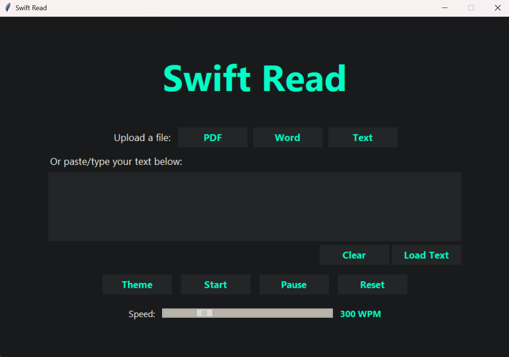

# 🚀 SwiftRead - Speed Reading App



**Read faster, comprehend better!** SwiftRead is a Python-based speed reading application that helps you read text at customizable speeds while maintaining comprehension. Perfect for students, researchers, and book lovers!

## ✨ Features

- 📖 **Multi-format support**: Upload PDFs, Word docs, or TXT files (TXT fully supported now, others in progress)
- ⚡ **Adjustable speed**: 100-1000 words per minute
- 🎨 **Customizable themes**: Change colors to your preference
- 🕒 **Pause/Resume**: Control your reading flow
- 📊 **Progress tracking**: See how much you've read

## 🛠️ Installation

### Option 1: Ready-to-Run (Easiest)
1. Download `SwiftRead.zip` from [Releases](https://github.com/Firefuries9999/SwiftRead/releases)
2. Extract the zip file
3. Run `SwiftRead.exe`

### Option 2: From Source (For Developers)
```bash
# Clone the repository
git clone https://github.com/Firefuries9999/SwiftRead.git
cd SwiftRead

# Install dependencies
pip install PyPDF2 python-docx

# Run the application
python swiftread.py
🏃‍♂️ Usage
Paste text or upload a file

Adjust reading speed using the slider

Click "Start" to begin speed reading

Use "Pause" to take breaks

🎨 Customization
Customize the app to your liking:

Change accent colors via the Theme button

Modify reading speeds (100-1000 WPM)

Adjust font sizes in the code (FONT_MAIN/FONT_TEXT variables)

🤝 Contributing
We welcome contributions! Here's how:

Fork the project

Create your feature branch: git checkout -b feature/AmazingFeature

Commit your changes: git commit -m 'Add amazing feature'

Push to the branch: git push origin feature/AmazingFeature

Open a Pull Request

🐛 Known Issues
PDF and Word support still in development

Icon may not appear in taskbar on some systems

📜 License
Distributed under the MIT License. See LICENSE for more information.

📧 Contact
Firefuries - firefuries24@gmail.com

🔗 Project Link: https://github.com/Firefuries9999/SwiftRead
